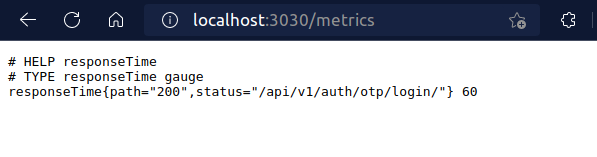

# Prometheus Golang Exporter from log file (with pre-configured grafana dashboard)

## What it does
<hr>

fetch and register metrics from configs from "_env.yml_" file. then set and update value of metrics based on
logs line by line once new log is added.

### env structure:
    
> * logs : define logs levels which should be pushed to prometheus as metric
> * confs : name / log file  address / regex pattern to fetch fields from logs

yaml file example: 
```
logs:
  - "response"
confs:
  - name: "response"
    file: "../logs/responses.log"
    regex: "path:(?P<L_responseTime_path>[^|]*).*response_time:(?P<M_responseTime_gauge>[^|]*).*status:(?P<L_responseTime_status>[^|]*)"
```
log example based on previous regex pattern:

```
2022-12-12T11:53:35|response_logger|INFO|request_id:1670846006290592061|m_responseTime_gauge|path:/api/v1/auth/otp/login/|body:"{\"detail\":\"There was an error parsing the body\"}"|response_time:60|status:200
```

generated metric example:



## Usage
<hr>

### Prerequisite
1. Build required docker image for exporter : 

    run this command to build "_golangprom-exporter:1.0_" image from dockerfile

    ```
    docker build -t golangprom-exporter:1.0 .
    ```
   > ! you  can tag image to any name you would but you have to change image name of _go-exporter_ service in compose file after that.
2. Install docker-compose
3. Prepare env yaml file
> NOTE : you can skip next configurations and use default configurations of project
4. Prepare prometheus configs yaml file (optional) :          
    as example:
    ```
   global:
      scrape_interval: 1s
      evaluation_interval: 2s
      scrape_timeout: 0s900ms
   scrape_configs:
      # processing prometheus service metrics
      - job_name: prometheus
        static_configs:
          - targets: ["localhost:9090"] # address of prometheus service
      # processing golang exporter metrics
      - job_name: logging
        static_configs:
          - targets: ["go-exporter:3030"] # address of exporter service
   ```
if want to use pre-configured grafana dashboard continue these steps
5. Prepare grafana datasource config file (optional) :          
   define prometheus instance to fetch data. change parameters in _grafana/datasources/datasource.yml_ to your desire config or just edit _url of prometheus instance_
    > url: http://prometheus-go-exporter:9090
6. Prepare grafana dashboard config file (optional) :       
   *  _grafana/datasources/dashboards/dashboard.yml_ : specify datasource which defined in previous step to read visualization data from it.     
   as example:
   ```
   apiVersion: 1
   providers:
     - name: 'Prometheus' # datasource name
       orgId: 1
       folder: ''
       type: file
       disableDeletion: false
       editable: true
       options:
         path: /etc/grafana/provisioning/dashboards
   ```
   *  _grafana/datasources/dashboards/*.json_ : json file of configured dashboard (can design dashboard in grafana panel and export it as json file).      
      define this file as "GF_DASHBOARDS_DEFAULT_HOME_DASHBOARD_PATH" compose environment variable to show it as home dashboard instead of grafana default home dashboard.

### Run
<hr>

place "_logs_" folder in outer directory from project directory ( or change mount path in compose file )  

then run this command in project directory to services start working
```
docker-compose up -d
```